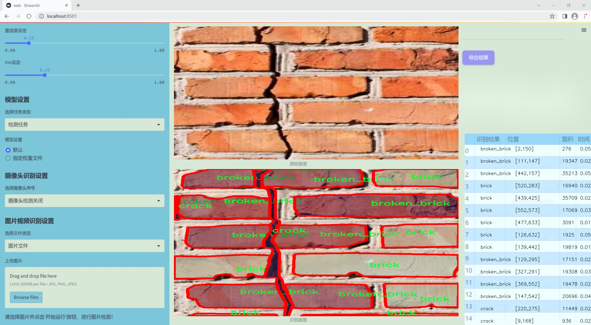
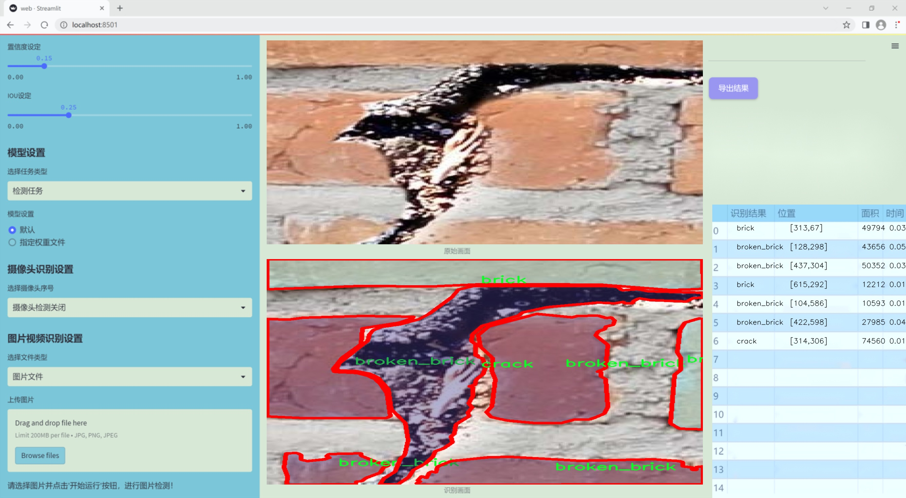
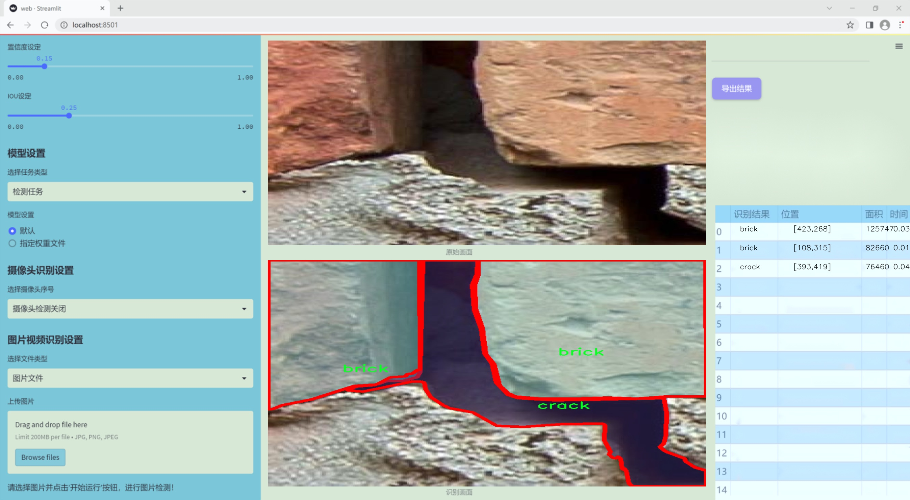
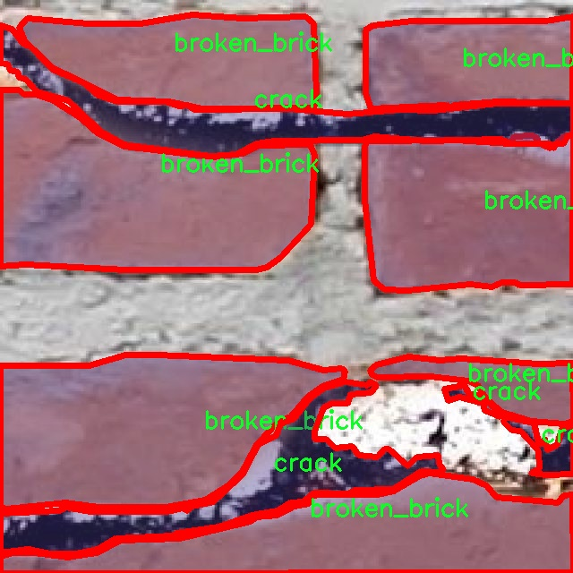
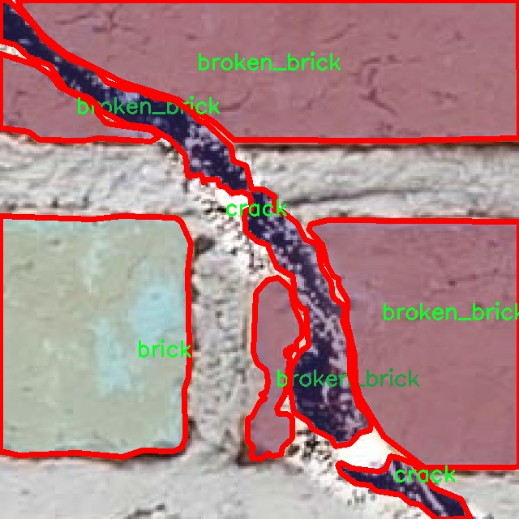
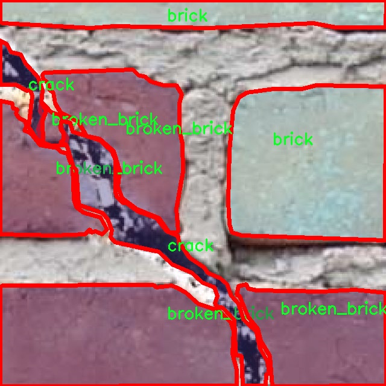
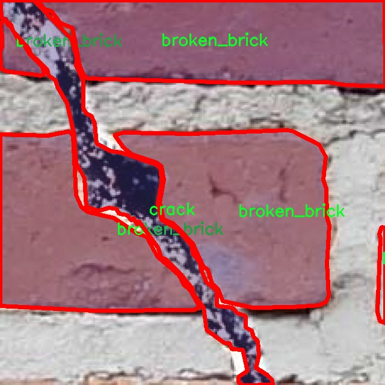
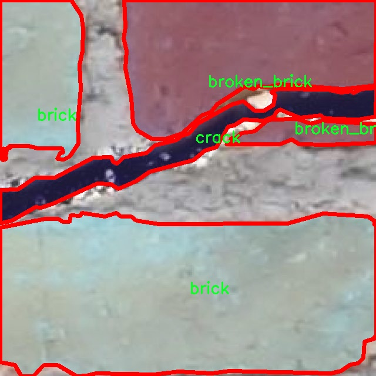

### 1.背景意义

研究背景与意义

随着城市化进程的加快，建筑物的安全性和耐久性日益受到关注。砖石结构作为一种常见的建筑形式，其在长期使用过程中容易出现裂缝，这不仅影响建筑物的美观，更可能导致结构的安全隐患。因此，及时、准确地检测砖石结构中的裂缝，对于维护建筑物的安全性和延长其使用寿命具有重要意义。传统的裂缝检测方法多依赖人工巡检，效率低下且容易受到主观因素的影响，难以保证检测结果的准确性和一致性。

近年来，计算机视觉技术的迅猛发展为裂缝检测提供了新的解决方案。基于深度学习的目标检测算法，尤其是YOLO（You Only Look Once）系列模型，因其高效的实时检测能力和良好的准确性，逐渐成为裂缝检测领域的研究热点。YOLOv11作为该系列的最新版本，具备更强的特征提取能力和更快的推理速度，能够更好地应对复杂环境下的裂缝检测任务。

本研究旨在基于改进的YOLOv11模型，构建一个高效的砖石结构裂缝检测系统。我们使用了一个包含1300张图像的数据集，该数据集涵盖了三种类别：砖块、破损砖块和裂缝。通过对这些图像的实例分割和特征学习，期望能够实现对砖石结构中裂缝的精准定位和分类。该系统的实现不仅可以提高裂缝检测的自动化水平，还能为建筑物的维护和管理提供数据支持，进而提升建筑物的安全性和使用效率。

总之，基于改进YOLOv11的砖石结构裂缝检测系统的研究，具有重要的理论价值和实际应用意义。它不仅为计算机视觉技术在建筑领域的应用提供了新的思路，也为后续相关研究奠定了基础。

### 2.视频效果

[2.1 视频效果](https://www.bilibili.com/video/BV1w8k7YvEzD/)

### 3.图片效果







##### [项目涉及的源码数据来源链接](https://kdocs.cn/l/cszuIiCKVNis)**

注意：本项目提供训练的数据集和训练教程,由于版本持续更新,暂不提供权重文件（best.pt）,请按照6.训练教程进行训练后实现上图演示的效果。

### 4.数据集信息

##### 4.1 本项目数据集类别数＆类别名

nc: 3
names: ['brick', 'broken_brick', 'crack']


该项目为【图像分割】数据集，请在【训练教程和Web端加载模型教程（第三步）】这一步的时候按照【图像分割】部分的教程来训练

##### 4.2 本项目数据集信息介绍

本项目数据集信息介绍

本项目所使用的数据集专注于砖石结构裂缝的检测，旨在为改进YOLOv11模型提供高质量的训练数据。数据集的主题为“Masonry Crack”，主要涵盖砖石结构中常见的几种类别，包括“brick”（砖块）、“broken_brick”（破损砖块）和“crack”（裂缝）。通过对这些类别的细致标注，数据集为模型的训练提供了丰富的样本，确保其在实际应用中能够有效识别和分类不同类型的砖石结构损伤。

数据集中包含的“brick”类别代表了完整的砖块，这一类别的样本有助于模型学习识别正常的砖石结构，以便在后续的检测中进行对比分析。另一方面，“broken_brick”类别则包含了各种破损程度的砖块，这些样本能够帮助模型理解砖石结构在遭受外力或环境影响后可能出现的破损特征。最后，“crack”类别则专注于裂缝的检测，样本中包含了不同宽度、深度和形状的裂缝，这些信息对于模型的精确识别至关重要。

整个数据集经过精心筛选和标注，确保每个类别的样本数量均衡，能够有效支持模型的训练过程。通过对这些数据的深入分析和处理，模型将能够更好地适应复杂的砖石结构环境，提高裂缝检测的准确性和可靠性。此外，数据集的多样性和丰富性也为后续的研究和应用提供了广阔的空间，使得该项目在砖石结构健康监测领域具有重要的实际意义和应用价值。











### 5.全套项目环境部署视频教程（零基础手把手教学）

[5.1 所需软件PyCharm和Anaconda安装教程（第一步）](https://www.bilibili.com/video/BV1BoC1YCEKi/?spm_id_from=333.999.0.0&vd_source=bc9aec86d164b67a7004b996143742dc)


[5.2 安装Python虚拟环境创建和依赖库安装视频教程（第二步）](https://www.bilibili.com/video/BV1ZoC1YCEBw?spm_id_from=333.788.videopod.sections&vd_source=bc9aec86d164b67a7004b996143742dc)

### 6.改进YOLOv11训练教程和Web_UI前端加载模型教程（零基础手把手教学）

[6.1 改进YOLOv11训练教程和Web_UI前端加载模型教程（第三步）](https://www.bilibili.com/video/BV1BoC1YCEhR?spm_id_from=333.788.videopod.sections&vd_source=bc9aec86d164b67a7004b996143742dc)


按照上面的训练视频教程链接加载项目提供的数据集，运行train.py即可开始训练



     Epoch   gpu_mem       box       obj       cls    labels  img_size
     1/200     20.8G   0.01576   0.01955  0.007536        22      1280: 100%|██████████| 849/849 [14:42<00:00,  1.04s/it]
               Class     Images     Labels          P          R     mAP@.5 mAP@.5:.95: 100%|██████████| 213/213 [01:14<00:00,  2.87it/s]
                 all       3395      17314      0.994      0.957      0.0957      0.0843

     Epoch   gpu_mem       box       obj       cls    labels  img_size
     2/200     20.8G   0.01578   0.01923  0.007006        22      1280: 100%|██████████| 849/849 [14:44<00:00,  1.04s/it]
               Class     Images     Labels          P          R     mAP@.5 mAP@.5:.95: 100%|██████████| 213/213 [01:12<00:00,  2.95it/s]
                 all       3395      17314      0.996      0.956      0.0957      0.0845

     Epoch   gpu_mem       box       obj       cls    labels  img_size
     3/200     20.8G   0.01561    0.0191  0.006895        27      1280: 100%|██████████| 849/849 [10:56<00:00,  1.29it/s]
               Class     Images     Labels          P          R     mAP@.5 mAP@.5:.95: 100%|███████   | 187/213 [00:52<00:00,  4.04it/s]
                 all       3395      17314      0.996      0.957      0.0957      0.0845


###### [项目数据集下载链接](https://kdocs.cn/l/cszuIiCKVNis)

### 7.原始YOLOv11算法讲解


ultralytics发布了最新的作品YOLOv11，这一次YOLOv11的变化相对于ultralytics公司的上一代作品YOLOv8变化不是很大的（YOLOv9、YOLOv10均不是ultralytics公司作品），其中改变的位置涉及到C2f变为C3K2，在SPPF后面加了一层类似于注意力机制的C2PSA，还有一个变化大家从yaml文件是看不出来的就是它的检测头内部替换了两个DWConv，以及模型的深度和宽度参数进行了大幅度调整，但是在损失函数方面就没有变化还是采用的CIoU作为边界框回归损失，下面带大家深入理解一下ultralytics最新作品YOLOv11的创新点。

**下图为最近的YOLO系列发布时间线！**


* * *

###### YOLOv11和YOLOv8对比

在YOLOYOLOv5，YOLOv8，和YOLOv11是ultralytics公司作品（ultralytics出品必属精品），下面用一张图片从yaml文件来带大家对比一下YOLOv8和YOLOv11的区别，配置文件变得内容比较少大家可以看一卡，左侧为YOLOv8右侧为YOLOv11，不同的点我用黑线标注了出来。


* * *

###### YOLOv11的网络结构解析

下面的图片为YOLOv11的网络结构图。


**其中主要创新点可以总结如下- > **

* * *

1\.
提出C3k2机制，其中C3k2有参数为c3k，其中在网络的浅层c3k设置为False（下图中可以看到c3k2第二个参数被设置为False，就是对应的c3k参数）。


此时所谓的C3k2就相当于YOLOv8中的C2f，其网络结构为一致的，其中的C3k机制的网络结构图如下图所示
**（为什么叫C3k2，我个人理解是因为C3k的调用时C3k其中的参数N固定设置为2的原因，个人理解不一定对** ）。


* * *

2\.
第二个创新点是提出C2PSA机制，这是一个C2（C2f的前身）机制内部嵌入了一个多头注意力机制，在这个过程中我还发现作者尝试了C2fPSA机制但是估计效果不如C2PSA，有的时候机制有没有效果理论上真的很难解释通，下图为C2PSA机制的原理图，仔细观察把Attention哪里去掉则C2PSA机制就变为了C2所以我上面说C2PSA就是C2里面嵌入了一个PSA机制。


* * *

3\.
第三个创新点可以说是原先的解耦头中的分类检测头增加了两个DWConv，具体的对比大家可以看下面两个图下面的是YOLOv11的解耦头，上面的是YOLOv8的解耦头.


我们上面看到了在分类检测头中YOLOv11插入了两个DWConv这样的做法可以大幅度减少参数量和计算量（原先两个普通的Conv大家要注意到卷积和是由3变为了1的，这是形成了两个深度可分离Conv），大家可能不太理解为什么加入了两个DWConv还能够减少计算量，以及什么是深度可分离Conv，下面我来解释一下。

> **`DWConv` 代表 Depthwise
> Convolution（深度卷积）**，是一种在卷积神经网络中常用的高效卷积操作。它主要用于减少计算复杂度和参数量，尤其在移动端或轻量化网络（如
> MobileNet）中十分常见。
>
> **1\. 标准卷积的计算过程**
>
> 在标准卷积操作中，对于一个输入张量（通常是一个多通道的特征图），卷积核的尺寸是 `(h, w, C_in)`，其中 `h` 和 `w`
> 是卷积核的空间尺寸，`C_in`
> 是输入通道的数量。而卷积核与输入张量做的是完整的卷积运算，每个输出通道都与所有输入通道相连并参与卷积操作，导致计算量比较大。
>
> 标准卷积的计算过程是这样的：
>
>   * 每个输出通道是所有输入通道的组合（加权求和），卷积核在每个位置都会计算与所有输入通道的点积。
>   * 假设有 `C_in` 个输入通道和 `C_out` 个输出通道，那么卷积核的总参数量是 `C_in * C_out * h * w`。
>

>
> 2\. **Depthwise Convolution（DWConv）**
>
> 与标准卷积不同， **深度卷积** 将输入的每个通道单独处理，即 **每个通道都有自己的卷积核进行卷积**
> ，不与其他通道进行交互。它可以被看作是标准卷积的一部分，专注于空间维度上的卷积运算。
>
> **深度卷积的计算过程：**
>
>   * 假设输入张量有 `C_in` 个通道，每个通道会使用一个 `h × w`
> 的卷积核进行卷积操作。这个过程称为“深度卷积”，因为每个通道独立进行卷积运算。
>   * 输出的通道数与输入通道数一致，每个输出通道只和对应的输入通道进行卷积，没有跨通道的组合。
>   * 参数量和计算量相比标准卷积大大减少，卷积核的参数量是 `C_in * h * w`。
>

>
> **深度卷积的优点：**
>
>   1. **计算效率高** ：相对于标准卷积，深度卷积显著减少了计算量。它只处理空间维度上的卷积，不再处理通道间的卷积。
>   2.  **参数量减少** ：由于每个卷积核只对单个通道进行卷积，参数量大幅减少。例如，标准卷积的参数量为 `C_in * C_out * h *
> w`，而深度卷积的参数量为 `C_in * h * w`。
>   3.  **结合点卷积可提升效果** ：为了弥补深度卷积缺乏跨通道信息整合的问题，通常深度卷积后会配合 `1x1` 的点卷积（Pointwise
> Convolution）使用，通过 `1x1` 的卷积核整合跨通道的信息。这种组合被称为 **深度可分离卷积** （Depthwise
> Separable Convolution） | **这也是我们本文YOLOv11中的做法** 。
>

>
> 3\. **深度卷积与标准卷积的区别**
>
> 操作类型| 卷积核大小| 输入通道数| 输出通道数| 参数量  
> ---|---|---|---|---  
> 标准卷积| `h × w`| `C_in`| `C_out`| `C_in * C_out * h * w`  
> 深度卷积（DWConv）| `h × w`| `C_in`| `C_in`| `C_in * h * w`  
>  
> 可以看出，深度卷积在相同的卷积核大小下，参数量减少了约 `C_out` 倍
> （细心的人可以发现用最新版本的ultralytics仓库运行YOLOv8参数量相比于之前的YOLOv8以及大幅度减少了这就是因为检测头改了的原因但是名字还是Detect，所以如果你想继续用YOLOv8发表论文做实验那么不要更新最近的ultralytics仓库）。
>
> **4\. 深度可分离卷积 (Depthwise Separable Convolution)**
>
> 深度卷积常与 `1x1` 的点卷积配合使用，这称为深度可分离卷积。其过程如下：
>
>   1. 先对输入张量进行深度卷积，对每个通道独立进行空间卷积。
>   2. 然后通过 `1x1` 点卷积，对通道维度进行混合，整合不同通道的信息。
>

>
> 这样既可以保证计算量的减少，又可以保持跨通道的信息流动。
>
> 5\. **总结**
>
> `DWConv` 是一种高效的卷积方式，通过单独处理每个通道来减少计算量，结合 `1x1`
> 的点卷积，形成深度可分离卷积，可以在保持网络性能的同时极大地减少模型的计算复杂度和参数量。

**看到这里大家应该明白了为什么加入了两个DWConv还能减少参数量以及YOLOv11的检测头创新点在哪里。**

* * *

##### YOLOv11和YOLOv8还有一个不同的点就是其各个版本的模型（N - S - M- L - X）网络深度和宽度变了


可以看到在深度（depth）和宽度
（width）两个地方YOLOv8和YOLOv11是基本上完全不同了，这里我理解这么做的含义就是模型网络变小了，所以需要加深一些模型的放缩倍数来弥补模型之前丧失的能力从而来达到一个平衡。

> **本章总结：**
> YOLOv11的改进点其实并不多更多的都是一些小的结构上的创新，相对于之前的YOLOv5到YOLOv8的创新，其实YOLOv11的创新点不算多，但是其是ultralytics公司的出品，同时ultralytics仓库的使用量是非常多的（不像YOLOv9和YOLOv10）所以在未来的很长一段时间内其实YOLO系列估计不会再更新了，YOLOv11作为最新的SOTA肯定是十分适合大家来发表论文和创新的。
>

### 8.200+种全套改进YOLOV11创新点原理讲解

#### 8.1 200+种全套改进YOLOV11创新点原理讲解大全

由于篇幅限制，每个创新点的具体原理讲解就不全部展开，具体见下列网址中的改进模块对应项目的技术原理博客网址【Blog】（创新点均为模块化搭建，原理适配YOLOv5~YOLOv11等各种版本）

[改进模块技术原理博客【Blog】网址链接](https://gitee.com/qunmasj/good)


#### 8.2 精选部分改进YOLOV11创新点原理讲解

###### 这里节选部分改进创新点展开原理讲解(完整的改进原理见上图和[改进模块技术原理博客链接](https://gitee.com/qunmasj/good)【如果此小节的图加载失败可以通过CSDN或者Github搜索该博客的标题访问原始博客，原始博客图片显示正常】


### D-LKA Attention简介
自2010年代中期以来，卷积神经网络（CNNs）已成为许多计算机视觉应用的首选技术。它们能够从原始数据中自动提取复杂的特征表示，无需手动进行特征工程，这引起了医学图像分析社区的极大兴趣。许多成功的CNN架构，如U-Net、全卷积网络、DeepLab或SegCaps（分割胶囊），已经被开发出来。这些架构在语义分割任务中取得了巨大成功，先前的最新方法已经被超越。

在计算机视觉研究中，不同尺度下的目标识别是一个关键问题。在CNN中，可检测目标的大小与相应网络层的感受野尺寸密切相关。如果一个目标扩展到超出这个感受野的边界，这可能会导致欠分割结果。相反，与目标实际大小相比使用过大的感受野可能会限制识别，因为背景信息可能会对预测产生不必要的影响。

解决这个问题的一个有希望的方法涉及在并行使用具有不同尺寸的多个Kernel，类似于Inception块的机制。然而，由于参数和计算要求的指数增长，将Kernel大小增加以容纳更大的目标在实践中受到限制。因此，出现了各种策略，包括金字塔池化技术和不同尺度的扩张卷积，以捕获多尺度的上下文信息。

另一个直观的概念涉及将多尺度图像金字塔或它们的相关特征表示直接纳入网络架构。然而，这种方法存在挑战，特别是在管理训练和推理时间方面的可行性方面存在挑战。在这个背景下，使用编码器-解码器网络，如U-Net，已被证明是有利的。这样的网络在较浅的层中编码外观和位置，而在更深的层中，通过神经元的更广泛的感受野捕获更高的语义信息和上下文信息。

一些方法将来自不同层的特征组合在一起，或者预测来自不同尺寸的层的特征以使用多尺度的信息。此外，出现了从不同尺度的层中预测特征的方法，有效地实现了跨多个尺度的见解整合。然而，大多数编码器-解码器结构面临一个挑战：它们经常无法在不同尺度之间保持一致的特征，并主要使用最后一个解码器层生成分割结果。

语义分割是一项任务，涉及根据预定义的标签集为图像中的每个像素预测语义类别。这项任务要求提取高级特征同时保留初始的空间分辨率。CNNs非常适合捕获局部细节和低级信息，尽管以忽略全局上下文为代价。视觉Transformer（ViT）架构已经成为解决处理全局信息的视觉任务的关键，包括语义分割，取得了显著的成功。

ViT的基础是注意力机制，它有助于在整个输入序列上聚合信息。这种能力使网络能够合并远程的上下文提示，超越了CNN的有限感受野尺寸。然而，这种策略通常会限制ViT有效建模局部信息的能力。这种局限可能会妨碍它们检测局部纹理的能力，这对于各种诊断和预测任务至关重要。这种缺乏局部表示可以归因于ViT模型处理图像的特定方式。

ViT模型将图像分成一系列Patch，并使用自注意力机制来模拟它们之间的依赖关系。这种方法可能不如CNN模型中的卷积操作对感受野内提取局部特征有效。ViT和CNN模型之间的这种图像处理方法的差异可能解释了CNN模型在局部特征提取方面表现出色的原因。

近年来，已经开发出创新性方法来解决Transformer模型内部局部纹理不足的问题。其中一种方法是通过互补方法将CNN和ViT特征结合起来，以结合它们的优势并减轻局部表示的不足。TransUNet是这种方法的早期示例，它在CNN的瓶颈中集成了Transformer层，以模拟局部和全局依赖关系。HiFormer提出了一种解决方案，将Swin Transformer模块和基于CNN的编码器结合起来，生成两个多尺度特征表示，通过Double-Level Fusion模块集成。UNETR使用基于Transformer的编码器和CNN解码器进行3D医学图像分割。CoTr和TransBTS通过Transformer在低分辨率阶段增强分割性能，将CNN编码器和解码器连接在一起。

增强局部特征表示的另一种策略是重新设计纯Transformer模型内部的自注意力机制。在这方面，Swin-Unet在U形结构中集成了一个具有线性计算复杂性的Swin Transformer块作为多尺度 Backbone 。MISSFormer采用高效Transformer来解决视觉Transformer中的参数问题，通过在输入块上进行不可逆的降采样操作。D-Former引入了一个纯Transformer的管道，具有双重注意模块，以分段的方式捕获细粒度的局部注意和与多元单元的交互。然而，仍然存在一些特定的限制，包括计算效率低下，如TransUNet模型所示，对CNN Backbone 的严重依赖，如HiFormer所观察到的，以及对多尺度信息的忽略。

此外，目前的分割架构通常采用逐层处理3D输入 volumetric 的方法，无意中忽视了相邻切片之间的潜在相关性。这一疏忽限制了对 volumetric 信息的全面利用，因此损害了定位精度和上下文集成。此外，必须认识到，医学领域的病变通常在形状上发生变形。因此，用于医学图像分析的任何学习算法都必须具备捕捉和理解这些变形的能力。与此同时，该算法应保持计算效率，以便处理3D volumetric数据。

为了解决上述提到的挑战，作者提出了一个解决方案，即可变形大卷积核注意力模块（Deformable LKA module），它是作者网络设计的基本构建模块。这个模块明确设计成在有效处理上下文信息的同时保留局部描述符。作者的架构在这两个方面的平衡增强了实现精确语义分割的能力。

值得注意的是，参考该博客引入了一种基于数据的感受野的动态适应，不同于传统卷积操作中的固定滤波器Mask。这种自适应方法使作者能够克服与静态方法相关的固有限制。这种创新方法还扩展到了D-LKA Net架构的2D和3D版本的开发。

在3D模型的情况下，D-LKA机制被量身定制以适应3D环境，从而实现在不同 volumetric 切片之间无缝信息交互。最后，作者的贡献通过其计算效率得到进一步强调。作者通过仅依靠D-LKA概念的设计来实现这一点，在各种分割基准上取得了显著的性能，确立了作者的方法作为一种新的SOTA方法。

在本节中，作者首先概述方法论。首先，作者回顾了由Guo等人引入的大卷积核注意力（Large Kernel Attention，LKA）的概念。然后，作者介绍了作者对可变形LKA模块的创新探索。在此基础上，作者介绍了用于分割任务的2D和3D网络架构。

大卷积核提供了与自注意力机制类似的感受野。可以通过使用深度卷积、深度可扩展卷积和卷积来构建大卷积核，从而减少了参数和计算量。构建输入维度为和通道数的卷积核的深度卷积和深度可扩展卷积的卷积核大小的方程如下：


具有卷积核大小和膨胀率。参数数量和浮点运算（FLOPs）的计算如下：


FLOPs的数量与输入图像的大小成线性增长。参数的数量随通道数和卷积核大小的增加而呈二次增长。然而，由于它们通常都很小，因此它们不是限制因素。

为了最小化对于固定卷积核大小K的参数数量，可以将方程3对于膨胀率的导数设定为零：


例如，当卷积核大小为时，结果是。将这些公式扩展到3D情况是直接的。对于大小为和通道数C的输入，3D情况下参数数量和FLOPs 的方程如下：


具有卷积核大小和膨胀。


利用大卷积核进行医学图像分割的概念通过引入可变形卷积得以扩展。可变形卷积可以通过整数偏移自由调整采样网格以进行自由变形。额外的卷积层从特征图中学习出变形，从而创建一个偏移场。基于特征本身学习变形会导致自适应卷积核。这种灵活的卷积核形状可以提高病变或器官变形的表示，从而增强了目标边界的定义。

负责计算偏移的卷积层遵循其相应卷积层的卷积核大小和膨胀。双线性插值用于计算不在图像网格上的偏移的像素值。如图2所示，D-LKA模块可以表示为：


其中输入特征由表示，。表示为注意力图，其中每个值表示相应特征的相对重要性。运算符  表示逐元素乘法运算。值得注意的是，LKA不同于传统的注意力方法，它不需要额外的规范化函数，如或。这些规范化函数往往忽视高频信息，从而降低了基于自注意力的方法的性能。

在该方法的2D版本中，卷积层被可变形卷积所替代，因为可变形卷积能够改善对具有不规则形状和大小的目标的捕捉能力。这些目标在医学图像数据中常常出现，因此这种增强尤为重要。

然而，将可变形LKA的概念扩展到3D领域会带来一定的挑战。主要的约束来自于需要用于生成偏移的额外卷积层。与2D情况不同，由于输入和输出通道的性质，这一层无法以深度可分的方式执行。在3D环境中，输入通道对应于特征，而输出通道扩展到，其中是卷积核的大小。大卷积核的复杂性导致沿第3D的通道数扩展，导致参数和FLOPs大幅增加。因此，针对3D情况采用了另一种替代方法。在现有的LKA框架中，深度卷积之后引入了一个单独的可变形卷积层。这种战略性的设计调整旨在减轻扩展到3D领域所带来的挑战。


2D网络的架构如图1所示。第一变种使用MaxViT作为编码器组件，用于高效特征提取，而第二变种则结合可变形LKA层进行更精细、卓越的分割。

在更正式的描述中，编码器生成4个分层输出表示。首先，卷积干扰将输入图像的维度减小到。随后，通过4个MaxViT块的4个阶段进行特征提取，每个阶段后跟随降采样层。随着过程进展到解码器，实施了4个阶段的D-LKA层，每个阶段包含2个D-LKA块。然后，应用Patch扩展层以实现分辨率上采样，同时减小通道维度。最后，线性层负责生成最终的输出。

2D D-LKA块的结构包括LayerNorm、可变形LKA和多层感知器（MLP）。积分残差连接确保了有效的特征传播，即使在更深层也是如此。这个安排可以用数学方式表示为：


其中输入特征，层归一化LN，可变形LKA注意力，深度卷积，线性层和GeLU激活函数。

3D网络架构如图1所示，采用编码器-解码器设计进行分层结构化。首先，一个Patch嵌入层将输入图像的维度从（）减小到（）。在编码器中，采用了3个D-LKA阶段的序列，每个阶段包含3个D-LKA块。在每个阶段之后，通过降采样步骤将空间分辨率减半，同时将通道维度加倍。中央瓶颈包括另一组2个D-LKA块。解码器结构与编码器相对称。

为了将特征分辨率加倍，同时减少通道数，使用转置卷积。每个解码器阶段都使用3个D-LKA块来促进远距离特征依赖性。最终的分割输出由一个卷积层产生，后面跟随一个卷积层以匹配特定类别的通道要求。

为了建立输入图像和分割输出之间的直接连接，使用卷积形成了一个跳跃连接。额外的跳跃连接根据简单的加法对来自其他阶段的特征进行融合。最终的分割图是通过和卷积层的组合产生的。

3D D-LKA块包括层归一化，后跟D-LKA注意力，应用了残差连接的部分。随后的部分采用了一个卷积层，后面跟随一个卷积层，两者都伴随着残差连接。这个整个过程可以总结如下：


带有输入特征 、层归一化 、可变形 LKA 、卷积层 和输出特征 的公式。是指一个前馈网络，包括2个卷积层和激活函数。

表7显示了普通卷积和构建卷积的参数数量比较。尽管标准卷积的参数数量在通道数较多时急剧增加，但分解卷积的参数总体较低，并且增长速度不那么快。

与分解卷积相比，可变形分解卷积增加了大量参数，但仍然明显小于标准卷积。可变形卷积的主要参数是由偏移网络创建的。在这里，作者假设可变形深度卷积的Kernel大小为（5,5），可变形深度空洞卷积的Kernel大小为（7,7）。这导致了21×21大小的大Kernel的最佳参数数量。更高效地生成偏移量的方法将大大减少参数数量。


值得注意的是，引入可变形LKA确实会增加模型的参数数量和每秒的浮点运算次数（FLOPS）。然而，重要的是强调，这增加的计算负载不会影响作者模型的整体推理速度。

相反，对于Batch-size > 1，作者甚至观察到推理时间的减少，如图7所示。例如，基于作者的广泛实验，作者观察到对于Batch-size为16，具有可变形卷积和没有可变形卷积的推理时间分别为8.01毫秒和17.38毫秒。作者认为这是由于在2D中对可变形卷积的高效实现所致。为了测量时间，使用了大小为（）的随机输入。在GPU热身周期50次迭代之后，网络被推断了1000次。测量是在NVIDIA RTX 3090 GPU上进行的。


为了充分利用性能与参数之间的权衡关系，作者在图8中可视化了在Synapse 2D数据集上报告的DSC和HD性能以及基于参数数量的内存消耗。D-LKA Net引入了相当多的参数，约为101M。这比性能第二好的方法ScaleFormer使用的111.6M参数要少。

与更轻量级的DAEFormer模型相比，作者实现了更好的性能，这证明了参数增加的合理性。大多数参数来自于MaxViT编码器；因此，将编码器替换为更高效的编码器可以减少模型参数。值得注意的是，在此可视化中，作者最初将HD和内存值都归一化到[0, 100]范围内。随后，作者将它们从100缩小，以增强更高值的表示。


### 9.系统功能展示

图9.1.系统支持检测结果表格显示

  图9.2.系统支持置信度和IOU阈值手动调节

  图9.3.系统支持自定义加载权重文件best.pt(需要你通过步骤5中训练获得)

  图9.4.系统支持摄像头实时识别

  图9.5.系统支持图片识别

  图9.6.系统支持视频识别

  图9.7.系统支持识别结果文件自动保存

  图9.8.系统支持Excel导出检测结果数据


### 10. YOLOv11核心改进源码讲解

#### 10.1 transformer.py

以下是对代码的逐文件分析，保留了核心部分并进行了详细的中文注释：

```python
import torch
import torch.nn as nn
from functools import partial

from .prepbn import RepBN, LinearNorm
from ..modules.transformer import TransformerEncoderLayer

__all__ = ['AIFI_RepBN']

# 定义线性归一化的部分函数，使用LayerNorm和RepBN
ln = nn.LayerNorm
linearnorm = partial(LinearNorm, norm1=ln, norm2=RepBN, step=60000)

class TransformerEncoderLayer_RepBN(TransformerEncoderLayer):
    def __init__(self, c1, cm=2048, num_heads=8, dropout=0, act=..., normalize_before=False):
        # 初始化父类TransformerEncoderLayer
        super().__init__(c1, cm, num_heads, dropout, act, normalize_before)
        
        # 使用线性归一化替代原有的归一化层
        self.norm1 = linearnorm(c1)
        self.norm2 = linearnorm(c1)

class AIFI_RepBN(TransformerEncoderLayer_RepBN):
    """定义AIFI变换器层。"""

    def __init__(self, c1, cm=2048, num_heads=8, dropout=0, act=nn.GELU(), normalize_before=False):
        """使用指定参数初始化AIFI实例。"""
        super().__init__(c1, cm, num_heads, dropout, act, normalize_before)

    def forward(self, x):
        """AIFI变换器层的前向传播。"""
        c, h, w = x.shape[1:]  # 获取输入张量的通道数、高度和宽度
        pos_embed = self.build_2d_sincos_position_embedding(w, h, c)  # 构建二维正弦余弦位置嵌入
        
        # 将输入张量从形状[B, C, H, W]展平为[B, HxW, C]
        x = super().forward(x.flatten(2).permute(0, 2, 1), pos=pos_embed.to(device=x.device, dtype=x.dtype))
        
        # 将输出张量的形状转换回[B, C, H, W]
        return x.permute(0, 2, 1).view([-1, c, h, w]).contiguous()

    @staticmethod
    def build_2d_sincos_position_embedding(w, h, embed_dim=256, temperature=10000.0):
        """构建二维正弦余弦位置嵌入。"""
        assert embed_dim % 4 == 0, "嵌入维度必须是4的倍数，以便进行二维正弦余弦位置嵌入"
        
        # 创建宽度和高度的网格
        grid_w = torch.arange(w, dtype=torch.float32)
        grid_h = torch.arange(h, dtype=torch.float32)
        grid_w, grid_h = torch.meshgrid(grid_w, grid_h, indexing="ij")
        
        pos_dim = embed_dim // 4  # 计算位置维度
        omega = torch.arange(pos_dim, dtype=torch.float32) / pos_dim
        omega = 1.0 / (temperature**omega)  # 计算频率

        # 计算宽度和高度的正弦余弦值
        out_w = grid_w.flatten()[..., None] @ omega[None]
        out_h = grid_h.flatten()[..., None] @ omega[None]

        # 返回合并的正弦余弦位置嵌入
        return torch.cat([torch.sin(out_w), torch.cos(out_w), torch.sin(out_h), torch.cos(out_h)], 1)[None]
```

### 代码核心部分说明：
1. **归一化层**：使用`LinearNorm`和`RepBN`进行归一化，替代了传统的归一化方法。
2. **前向传播**：在`AIFI_RepBN`类中，前向传播方法将输入张量展平并传递给父类的前向方法，同时构建位置嵌入。
3. **位置嵌入**：`build_2d_sincos_position_embedding`方法用于生成二维正弦余弦位置嵌入，增强模型对位置信息的理解。

这段代码实现了一个基于Transformer的网络层，结合了新的归一化技术和位置编码方法，适用于处理图像等具有空间结构的数据。

这个文件定义了一个名为 `transformer.py` 的 PyTorch 模块，主要实现了一个带有重参数化批归一化（RepBN）的 Transformer 编码器层，具体是 `AIFI_RepBN` 类。首先，文件导入了必要的 PyTorch 库和一些自定义模块。

在文件中，使用了 `partial` 函数来创建一个新的线性归一化函数 `linearnorm`，这个函数结合了 `LayerNorm` 和 `RepBN`，并设定了一个步长参数。接下来，定义了一个 `TransformerEncoderLayer_RepBN` 类，它继承自 `TransformerEncoderLayer`，并在初始化时调用父类的构造函数，同时定义了两个归一化层 `norm1` 和 `norm2`，这两个层都使用了之前定义的 `linearnorm`。

接着，定义了 `AIFI_RepBN` 类，它是 `TransformerEncoderLayer_RepBN` 的子类，表示一个特定的 AIFI Transformer 层。在其构造函数中，调用了父类的构造函数，并可以接受一些参数，如输入通道数、隐藏层维度、头数、丢弃率、激活函数等。

在 `AIFI_RepBN` 类中，重写了 `forward` 方法，负责前向传播。在这个方法中，首先获取输入张量的形状信息（通道数、高度和宽度），然后构建一个二维的正弦余弦位置嵌入。接着，将输入张量的形状从 `[B, C, H, W]` 展平为 `[B, HxW, C]`，并调用父类的 `forward` 方法进行处理，最后将输出张量的形状恢复为 `[B, C, H, W]`。

此外，`AIFI_RepBN` 类还定义了一个静态方法 `build_2d_sincos_position_embedding`，用于生成二维的正弦余弦位置嵌入。这个方法接受宽度、高度和嵌入维度等参数，首先检查嵌入维度是否能被4整除，然后生成对应的网格坐标，并计算出位置嵌入。最终，返回一个包含正弦和余弦值的张量。

整体来看，这个文件实现了一个基于 Transformer 的编码器层，结合了重参数化批归一化，适用于处理具有空间结构的数据（如图像），并且通过位置嵌入来保留位置信息。

#### 10.2 revcol.py

以下是代码中最核心的部分，并附上详细的中文注释：

```python
import torch
import torch.nn as nn

# 定义一个自定义的反向传播函数
class ReverseFunction(torch.autograd.Function):
    @staticmethod
    def forward(ctx, run_functions, alpha, *args):
        # 提取运行的函数和缩放因子
        l0, l1, l2, l3 = run_functions
        alpha0, alpha1, alpha2, alpha3 = alpha
        
        # 保存上下文信息
        ctx.run_functions = run_functions
        ctx.alpha = alpha
        
        # 禁用梯度计算
        with torch.no_grad():
            # 获取输入张量
            [x, c0, c1, c2, c3] = args
            
            # 计算每一层的输出
            c0 = l0(x, c1) + c0 * alpha0
            c1 = l1(c0, c2) + c1 * alpha1
            c2 = l2(c1, c3) + c2 * alpha2
            c3 = l3(c2, None) + c3 * alpha3
        
        # 保存中间结果以供反向传播使用
        ctx.save_for_backward(x, c0, c1, c2, c3)
        return x, c0, c1, c2, c3

    @staticmethod
    def backward(ctx, *grad_outputs):
        # 获取保存的张量
        x, c0, c1, c2, c3 = ctx.saved_tensors
        l0, l1, l2, l3 = ctx.run_functions
        alpha0, alpha1, alpha2, alpha3 = ctx.alpha
        
        # 获取梯度
        gx_right, g0_right, g1_right, g2_right, g3_right = grad_outputs
        
        # 分离张量并开启梯度计算
        (x, c0, c1, c2, c3) = detach_and_grad((x, c0, c1, c2, c3))

        # 反向传播计算
        with torch.enable_grad():
            # 计算每一层的梯度
            g3_up = g3_right
            g3_left = g3_up * alpha3  # shortcut
            oup3 = l3(c2, None)
            torch.autograd.backward(oup3, g3_up, retain_graph=True)
            c3_left = (1 / alpha3) * (c3 - oup3)  # 特征反转
            
            g2_up = g2_right + c2.grad
            g2_left = g2_up * alpha2  # shortcut
            oup2 = l2(c1, c3_left)
            torch.autograd.backward(oup2, g2_up, retain_graph=True)
            
            g1_up = g1_right + c1.grad
            g1_left = g1_up * alpha1  # shortcut
            oup1 = l1(c0, c2_left)
            torch.autograd.backward(oup1, g1_up, retain_graph=True)
            
            g0_up = g0_right + c0.grad
            g0_left = g0_up * alpha0  # shortcut
            oup0 = l0(x, c1_left)
            torch.autograd.backward(oup0, g0_up)

        # 返回每一层的梯度
        return None, None, gx_up, g0_left, g1_left, g2_left, g3_left

# 定义一个子网络类
class SubNet(nn.Module):
    def __init__(self, channels, layers, kernel, first_col, save_memory) -> None:
        super().__init__()
        self.save_memory = save_memory
        
        # 初始化缩放因子
        self.alpha0 = nn.Parameter(torch.ones((1, channels[0], 1, 1)), requires_grad=True)
        self.alpha1 = nn.Parameter(torch.ones((1, channels[1], 1, 1)), requires_grad=True)
        self.alpha2 = nn.Parameter(torch.ones((1, channels[2], 1, 1)), requires_grad=True)
        self.alpha3 = nn.Parameter(torch.ones((1, channels[3], 1, 1)), requires_grad=True)

        # 初始化各个层级
        self.level0 = Level(0, channels, layers, kernel, first_col)
        self.level1 = Level(1, channels, layers, kernel, first_col)
        self.level2 = Level(2, channels, layers, kernel, first_col)
        self.level3 = Level(3, channels, layers, kernel, first_col)

    def forward(self, *args):
        # 根据是否保存内存选择前向传播方式
        if self.save_memory:
            return self._forward_reverse(*args)
        else:
            return self._forward_nonreverse(*args)

# 定义主网络类
class RevCol(nn.Module):
    def __init__(self, kernel='C2f', channels=[32, 64, 96, 128], layers=[2, 3, 6, 3], num_subnet=5, save_memory=True) -> None:
        super().__init__()
        self.num_subnet = num_subnet
        self.channels = channels
        self.layers = layers

        # 初始化网络的输入层
        self.stem = Conv(3, channels[0], k=4, s=4, p=0)

        # 初始化多个子网络
        for i in range(num_subnet):
            first_col = True if i == 0 else False
            self.add_module(f'subnet{str(i)}', SubNet(channels, layers, kernel, first_col, save_memory=save_memory))

    def forward(self, x):
        # 进行前向传播
        c0, c1, c2, c3 = 0, 0, 0, 0
        x = self.stem(x)        
        for i in range(self.num_subnet):
            c0, c1, c2, c3 = getattr(self, f'subnet{str(i)}')(x, c0, c1, c2, c3)       
        return [c0, c1, c2, c3]
```

### 代码核心部分说明：
1. **ReverseFunction**: 这是一个自定义的反向传播函数，主要用于实现反向传播时的特征反转。它的 `forward` 方法计算前向传播，`backward` 方法计算反向传播的梯度。

2. **SubNet**: 这个类表示一个子网络，包含多个层级（Level），并且根据是否保存内存选择不同的前向传播方式。

3. **RevCol**: 这是主网络类，负责初始化多个子网络，并进行前向传播。它的结构允许在多个子网络之间传递特征。

### 其他说明：
- 代码中使用了 PyTorch 的自动求导机制，通过 `torch.autograd.Function` 自定义了前向和反向传播的逻辑。
- 通过使用缩放因子（alpha），可以在每一层中对特征进行加权，从而实现特征融合。
- 反向传播过程中使用了 `detach_and_grad` 函数来处理张量的梯度和分离操作。

这个程序文件 `revcol.py` 是一个使用 PyTorch 框架实现的深度学习模型，主要用于构建一种名为 RevCol 的网络结构。该结构结合了反向传播和融合策略，以提高计算效率和内存使用效率。代码中定义了多个类和函数，下面是对其主要内容的逐步讲解。

首先，文件导入了必要的 PyTorch 模块和自定义模块，包括卷积层和其他基本构件。接着，定义了一些工具函数，例如 `get_gpu_states`、`get_gpu_device`、`set_device_states` 和 `detach_and_grad`，这些函数用于管理 GPU 状态、获取设备信息以及处理张量的梯度和分离操作。

`get_gpu_states` 函数用于获取指定 GPU 设备的随机数生成器状态，而 `get_gpu_device` 函数则用于从输入的张量中提取出使用的 GPU 设备。`set_device_states` 函数用于设置 CPU 和 GPU 的随机数生成器状态，确保在训练过程中状态的一致性。`detach_and_grad` 函数则用于处理输入张量，确保在反向传播时不计算梯度。

接下来，定义了一个名为 `ReverseFunction` 的类，它继承自 `torch.autograd.Function`，实现了自定义的前向和反向传播逻辑。在 `forward` 方法中，模型的各个层通过传入的函数和参数进行计算，并保存中间结果和状态。反向传播的 `backward` 方法则根据保存的状态和梯度信息，逐层计算梯度并进行更新。

然后，定义了 `Fusion`、`Level` 和 `SubNet` 类。`Fusion` 类用于实现不同层之间的融合操作，`Level` 类则表示网络中的一个层级，包含了融合和卷积模块。`SubNet` 类表示一个子网络，包含多个层级的组合，并实现了前向传播的两种模式：非反向传播和反向传播。

在 `SubNet` 中，`_forward_nonreverse` 方法执行常规的前向传播，而 `_forward_reverse` 方法则调用 `ReverseFunction` 进行反向传播。`forward` 方法根据是否需要节省内存来选择调用哪种前向传播方式，并在调用前对缩放因子进行限制，确保其绝对值不小于一定阈值。

最后，`RevCol` 类是整个模型的顶层结构，负责初始化和组织多个子网络。它在构造函数中定义了网络的基础卷积层，并根据指定的子网络数量动态添加多个 `SubNet` 实例。在 `forward` 方法中，输入数据通过各个子网络进行处理，最终返回多个特征图。

整体来看，这个程序实现了一个高效的深度学习模型，通过自定义的反向传播机制和层级融合策略，旨在优化计算资源的使用和提升模型的性能。

#### 10.3 dyhead_prune.py

以下是经过简化和注释的核心代码部分：

```python
import torch
import torch.nn as nn
import torch.nn.functional as F

class DyReLU(nn.Module):
    """动态ReLU激活函数，具有可学习的参数。"""
    def __init__(self, inp, reduction=4, lambda_a=1.0, use_bias=True):
        super(DyReLU, self).__init__()
        self.oup = inp  # 输出通道数
        self.lambda_a = lambda_a * 2  # 参数调整因子
        self.avg_pool = nn.AdaptiveAvgPool2d(1)  # 自适应平均池化层

        # 确定压缩比
        squeeze = inp // reduction
        self.fc = nn.Sequential(
            nn.Linear(inp, squeeze),  # 全连接层，输入到压缩层
            nn.ReLU(inplace=True),  # ReLU激活
            nn.Linear(squeeze, self.oup * 2),  # 压缩层到输出层
            h_sigmoid()  # 使用h_sigmoid激活
        )

    def forward(self, x):
        """前向传播函数。"""
        b, c, h, w = x.size()  # 获取输入的批次大小、通道数、高度和宽度
        y = self.avg_pool(x).view(b, c)  # 通过自适应平均池化获取特征
        y = self.fc(y).view(b, self.oup * 2, 1, 1)  # 通过全连接层处理特征

        # 分离出a和b参数
        a1, b1 = torch.split(y, self.oup, dim=1)
        a1 = (a1 - 0.5) * self.lambda_a + 1.0  # 调整a1
        b1 = b1 - 0.5  # 调整b1

        out = x * a1 + b1  # 计算输出
        return out  # 返回结果

class DyDCNv2(nn.Module):
    """带有归一化层的可调变形卷积。"""
    def __init__(self, in_channels, out_channels, stride=1, norm_cfg=dict(type='GN', num_groups=16)):
        super().__init__()
        self.conv = ModulatedDeformConv2d(in_channels, out_channels, 3, stride=stride, padding=1)  # 可调变形卷积
        self.norm = build_norm_layer(norm_cfg, out_channels)[1] if norm_cfg else None  # 归一化层

    def forward(self, x, offset, mask):
        """前向传播函数。"""
        x = self.conv(x.contiguous(), offset, mask)  # 进行卷积操作
        if self.norm:
            x = self.norm(x)  # 应用归一化
        return x  # 返回结果

class DyHeadBlock_Prune(nn.Module):
    """包含三种注意力机制的DyHead块。"""
    def __init__(self, in_channels, norm_type='GN'):
        super().__init__()
        self.spatial_conv_high = DyDCNv2(in_channels, in_channels)  # 高层卷积
        self.spatial_conv_mid = DyDCNv2(in_channels, in_channels)  # 中层卷积
        self.spatial_conv_low = DyDCNv2(in_channels, in_channels, stride=2)  # 低层卷积
        self.spatial_conv_offset = nn.Conv2d(in_channels, 27, 3, padding=1)  # 偏移和掩码卷积

    def forward(self, x, level):
        """前向传播函数。"""
        offset_and_mask = self.spatial_conv_offset(x[level])  # 计算偏移和掩码
        offset = offset_and_mask[:, :18, :, :]  # 提取偏移
        mask = offset_and_mask[:, 18:, :, :].sigmoid()  # 提取掩码并应用sigmoid

        mid_feat = self.spatial_conv_mid(x[level], offset, mask)  # 中层特征
        sum_feat = mid_feat  # 初始化特征和

        # 处理低层特征
        if level > 0:
            low_feat = self.spatial_conv_low(x[level - 1], offset, mask)
            sum_feat += low_feat

        # 处理高层特征
        if level < len(x) - 1:
            high_feat = F.interpolate(self.spatial_conv_high(x[level + 1], offset, mask), size=x[level].shape[-2:], mode='bilinear', align_corners=True)
            sum_feat += high_feat

        return sum_feat  # 返回汇总特征
```

### 代码说明：
1. **DyReLU**：实现了一个动态的ReLU激活函数，具有可学习的参数。通过自适应平均池化获取输入特征，并通过全连接层生成输出。
  
2. **DyDCNv2**：实现了带有归一化层的可调变形卷积。通过偏移和掩码对输入进行卷积操作，并可选择性地应用归一化。

3. **DyHeadBlock_Prune**：实现了一个包含多种注意力机制的块，利用不同层次的特征进行卷积和特征融合，生成最终的输出特征。

这个程序文件 `dyhead_prune.py` 是一个基于 PyTorch 的深度学习模块，主要实现了动态头（Dynamic Head）的一部分，包含了不同类型的激活函数、卷积层和注意力机制。以下是对代码的详细说明。

首先，文件导入了必要的库，包括 PyTorch 的核心库和一些用于构建神经网络的模块。它还尝试导入 `mmcv` 和 `mmengine` 中的一些功能，如果导入失败则会捕获异常。

接下来，定义了一个 `_make_divisible` 函数，用于确保某个值是可被指定的除数整除的，并且不会小于给定的最小值。这个函数在模型设计中常用于调整通道数，以便在硬件上更高效地运行。

然后，定义了几个激活函数类，包括 `swish`、`h_swish` 和 `h_sigmoid`。这些类都是继承自 `nn.Module`，并实现了各自的前向传播方法。`swish` 是一种新的激活函数，`h_swish` 和 `h_sigmoid` 则是对 ReLU 和 Sigmoid 的改进版本，适用于不同的场景。

接下来是 `DyReLU` 类的定义，它是一个动态 ReLU 激活函数的实现。这个类的构造函数中包含了多个参数，用于控制其行为，包括输入通道数、缩减比例、初始化参数等。在前向传播中，`DyReLU` 根据输入特征图的平均池化结果动态调整激活值，并可以选择性地应用空间注意力机制。

`DyDCNv2` 类实现了一个带有归一化层的可调变形卷积（Modulated Deformable Convolution），用于处理输入特征图并计算偏移量和掩码。这个类的构造函数中定义了卷积层和归一化层，并在前向传播中应用这些层。

最后，`DyHeadBlock_Prune` 类是整个模块的核心部分，结合了多个注意力机制。它的构造函数中初始化了多个卷积层和注意力模块。`forward` 方法中，首先计算偏移量和掩码，然后通过不同的卷积层处理输入特征图，并结合来自不同层次的特征，最终通过任务注意力模块生成输出。

整个代码结构清晰，功能模块化，便于扩展和修改。它展示了如何在深度学习模型中实现动态特性和多层次特征融合，适用于计算机视觉等领域的任务。

#### 10.4 conv.py

以下是经过简化并添加详细中文注释的核心代码部分：

```python
import math
import torch
import torch.nn as nn

def autopad(k, p=None, d=1):
    """自动计算填充以保持输出形状与输入相同。"""
    if d > 1:
        k = d * (k - 1) + 1 if isinstance(k, int) else [d * (x - 1) + 1 for x in k]  # 实际的卷积核大小
    if p is None:
        p = k // 2 if isinstance(k, int) else [x // 2 for x in k]  # 自动填充
    return p

class Conv(nn.Module):
    """标准卷积层，包含卷积、批归一化和激活函数。"""

    default_act = nn.SiLU()  # 默认激活函数

    def __init__(self, c1, c2, k=1, s=1, p=None, g=1, d=1, act=True):
        """初始化卷积层，包括输入通道、输出通道、卷积核大小、步幅、填充、分组、扩张和激活函数。"""
        super().__init__()
        self.conv = nn.Conv2d(c1, c2, k, s, autopad(k, p, d), groups=g, dilation=d, bias=False)  # 卷积层
        self.bn = nn.BatchNorm2d(c2)  # 批归一化层
        self.act = self.default_act if act is True else act if isinstance(act, nn.Module) else nn.Identity()  # 激活函数

    def forward(self, x):
        """前向传播：应用卷积、批归一化和激活函数。"""
        return self.act(self.bn(self.conv(x)))

class DWConv(Conv):
    """深度可分离卷积层，适用于通道数较大的情况。"""

    def __init__(self, c1, c2, k=1, s=1, d=1, act=True):
        """初始化深度卷积层，使用标准卷积的构造函数。"""
        super().__init__(c1, c2, k, s, g=math.gcd(c1, c2), d=d, act=act)

class DSConv(nn.Module):
    """深度可分离卷积模块，包含深度卷积和逐点卷积。"""

    def __init__(self, c1, c2, k=1, s=1, d=1, act=True):
        """初始化深度可分离卷积模块。"""
        super().__init__()
        self.dwconv = DWConv(c1, c1, 3)  # 深度卷积
        self.pwconv = Conv(c1, c2, 1)  # 逐点卷积

    def forward(self, x):
        """前向传播：先通过深度卷积，再通过逐点卷积。"""
        return self.pwconv(self.dwconv(x))

class ChannelAttention(nn.Module):
    """通道注意力模块，用于强调重要特征通道。"""

    def __init__(self, channels: int):
        """初始化通道注意力模块。"""
        super().__init__()
        self.pool = nn.AdaptiveAvgPool2d(1)  # 自适应平均池化
        self.fc = nn.Conv2d(channels, channels, 1, 1, 0, bias=True)  # 1x1卷积
        self.act = nn.Sigmoid()  # Sigmoid激活函数

    def forward(self, x: torch.Tensor) -> torch.Tensor:
        """前向传播：计算通道注意力并应用于输入。"""
        return x * self.act(self.fc(self.pool(x)))

class SpatialAttention(nn.Module):
    """空间注意力模块，用于强调重要空间位置。"""

    def __init__(self, kernel_size=7):
        """初始化空间注意力模块。"""
        super().__init__()
        assert kernel_size in {3, 7}, "kernel size must be 3 or 7"  # 确保卷积核大小合法
        padding = 3 if kernel_size == 7 else 1
        self.cv1 = nn.Conv2d(2, 1, kernel_size, padding=padding, bias=False)  # 卷积层
        self.act = nn.Sigmoid()  # Sigmoid激活函数

    def forward(self, x):
        """前向传播：计算空间注意力并应用于输入。"""
        return x * self.act(self.cv1(torch.cat([torch.mean(x, 1, keepdim=True), torch.max(x, 1, keepdim=True)[0]], 1)))

class CBAM(nn.Module):
    """卷积块注意力模块，结合通道和空间注意力。"""

    def __init__(self, c1, kernel_size=7):
        """初始化CBAM模块。"""
        super().__init__()
        self.channel_attention = ChannelAttention(c1)  # 通道注意力
        self.spatial_attention = SpatialAttention(kernel_size)  # 空间注意力

    def forward(self, x):
        """前向传播：依次应用通道注意力和空间注意力。"""
        return self.spatial_attention(self.channel_attention(x))
```

### 代码说明
1. **autopad**: 自动计算卷积层的填充，以确保输出的空间维度与输入相同。
2. **Conv**: 标准卷积层，包含卷积、批归一化和激活函数的组合。
3. **DWConv**: 深度卷积层，适用于通道数较大的情况，使用标准卷积的构造函数。
4. **DSConv**: 深度可分离卷积模块，包含深度卷积和逐点卷积，适用于特征提取。
5. **ChannelAttention**: 通道注意力模块，通过自适应平均池化和1x1卷积来强调重要特征通道。
6. **SpatialAttention**: 空间注意力模块，通过卷积操作来强调重要空间位置。
7. **CBAM**: 卷积块注意力模块，结合通道和空间注意力，以提高特征表达能力。

这个程序文件 `conv.py` 是一个用于实现卷积模块的 Python 脚本，主要依赖于 PyTorch 库。文件中定义了多个卷积相关的类和函数，目的是为深度学习模型提供各种卷积操作的实现。

首先，文件中导入了必要的库，包括 `math`、`numpy` 和 `torch` 以及 `torch.nn`。接着，定义了一个名为 `autopad` 的函数，用于根据给定的卷积核大小、填充和扩张参数自动计算填充量，以确保输出的形状与输入的形状相同。

接下来，定义了多个卷积类。`Conv` 类是一个标准的卷积层，包含卷积操作、批归一化和激活函数。构造函数接受多个参数，如输入通道数、输出通道数、卷积核大小、步幅、填充、分组、扩张和激活函数。`forward` 方法定义了前向传播过程，依次应用卷积、批归一化和激活函数。

`Conv2` 类是 `Conv` 类的简化版本，增加了一个 1x1 的卷积层，并在前向传播中将两个卷积的输出相加。它还提供了一个 `fuse_convs` 方法，用于融合卷积操作，以提高计算效率。

`LightConv` 类实现了一种轻量级卷积，使用了深度卷积（`DWConv`）和标准卷积的组合。`DWConv` 类则实现了深度卷积，适用于通道数较大的情况。

`DSConv` 类实现了深度可分离卷积，由深度卷积和逐点卷积组成。`DWConvTranspose2d` 类是深度转置卷积的实现，`ConvTranspose` 类则实现了转置卷积层，支持批归一化和激活函数。

`Focus` 类用于将空间信息聚焦到通道空间，通过对输入张量进行特定的切片和拼接操作来实现。`GhostConv` 类实现了 Ghost 卷积，结合了主要卷积和廉价操作以提高特征学习的效率。

`RepConv` 类实现了一种可重复的卷积结构，支持训练和推理状态，并提供了融合卷积的功能。`ChannelAttention` 和 `SpatialAttention` 类分别实现了通道注意力和空间注意力机制，用于特征的重标定。`CBAM` 类则结合了通道和空间注意力模块，形成一个完整的卷积块注意力模块。

最后，`Concat` 类用于在指定维度上连接多个张量，便于在模型中进行特征的组合。

总体而言，这个文件提供了一系列灵活且高效的卷积模块，适用于构建各种深度学习模型，尤其是在计算机视觉任务中。

### 11.完整训练+Web前端界面+200+种全套创新点源码、数据集获取


# [下载链接：https://mbd.pub/o/bread/Z5yamplw](https://mbd.pub/o/bread/Z5yamplw)